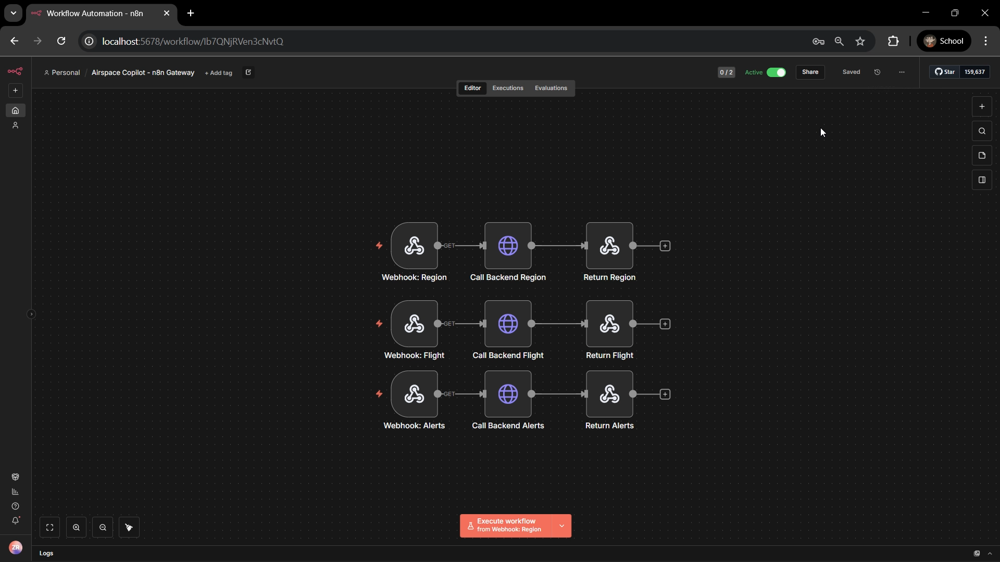

# Airspace Copilot

A real time flight monitoring system that uses AI agents to track flights and detect anomalies using the OpenSky Network API.

## Overview

This system monitors live flight traffic and provides intelligent insights through two modes:

**Traveler Mode**: Track a specific flight and get natural language updates through an AI powered chat interface.

**Operations Mode**: Monitor entire regions for flight activity with automatic anomaly detection and AI generated summaries.

## Features

* Multi agent system with Ops Analyst and Traveler Support agents
* Agent to agent communication for complex queries
* Real time data from OpenSky Network API
* Automated anomaly detection (unusual altitude, speed, patterns)
* n8n workflow automation for data processing
* Clean Streamlit web interface
* MCP server exposing flight data as tools

## Technologies

* **n8n** (Docker) for workflow automation and API gateway
* **CrewAI** for the multi agent framework
* **Groq API** for LLM powered reasoning
* **FastAPI** for the backend server
* **Streamlit** for the web interface
* **OpenSky Network** for live flight data

## Architecture

```
OpenSky API → Python Fetcher → JSON Storage → Backend API → n8n Webhooks → CrewAI Agents → Streamlit UI
```

The system has two AI agents that work together:

* **Ops Analyst Agent**: Monitors regions, detects anomalies, provides operational summaries
* **Traveler Support Agent**: Answers traveler questions about specific flights

## n8n Workflow

The workflow exposes three webhook endpoints that route requests to the backend API:



## Installation

### Prerequisites

* Python 3.11+
* Docker Desktop
* Groq API key (free from https://console.groq.com/)

### Option 1: Using Conda

```bash
# Create environment
conda create -n airspace-copilot python=3.11 -y

# Activate environment
conda activate airspace-copilot

# Install dependencies
pip install -r requirements.txt
```

### Option 2: Using pip

```bash
# Create virtual environment
python -m venv venv

# Activate (Windows)
venv\Scripts\activate

# Activate (Mac/Linux)
source venv/bin/activate

# Install dependencies
pip install -r requirements.txt
```

## Configuration

Create a `.env` file from the example:

```bash
copy .env.example .env
```

Edit `.env` and add your Groq API key:

```
GROQ_API_KEY=your_actual_api_key_here
```

You can also adjust the fetch interval (default is 720 seconds = 12 minutes):

```
FETCH_INTERVAL=720
```

## Setup n8n

Start n8n using Docker:

```bash
# If you already have n8n
docker start n8n

# If you need to create it
docker run -d --name n8n -p 5678:5678 -v ~/.n8n:/home/node/.n8n n8nio/n8n
```

Import the workflow:

1. Open http://localhost:5678
2. Go to Workflows
3. Click Import
4. Select `n8n_workflows/workflow_final.json`
5. Activate the workflow

## Running the System

You need to run 3 components in separate terminals:

**Terminal 1: Backend API**

```bash
python backend_api.py
```

**Terminal 2: Data Fetcher**

```bash
python n8n_workflows/opensky_fetcher.py loop
```

**Terminal 3: Frontend**

```bash
streamlit run frontend/app_n8n.py
```

The web interface will open at http://localhost:8501

## Usage

### Traveler Mode

1. Select **Traveler Mode** from the sidebar
2. Enter a flight callsign (e.g. UAL123) or ICAO24 code
3. Optionally add a label like "My flight"
4. Click **Track Flight**
5. Ask questions in the chat:
   * "Where is my flight now?"
   * "Is my flight climbing or descending?"
   * "Has my flight been circling for too long?"

### Operations Mode

1. Select **Operations Mode** from the sidebar
2. Choose a region (USA East Coast, Europe Central, Asia Pacific)
3. Click **Fetch Latest** to get current flights
4. View the flight table with live data
5. Check active alerts for detected anomalies
6. Click **Generate Summary** for AI analysis of the airspace

## Project Structure

```
.
├── agents/
│   ├── agent_config_n8n.py    # Agent definitions and MCP tools
│   └── anomaly_detector.py     # Anomaly detection logic
├── backend_api.py              # FastAPI backend server
├── data/
│   ├── snapshots/              # Flight data snapshots (JSON)
│   └── alerts/                 # Detected anomalies (JSON)
├── frontend/
│   └── app_n8n.py              # Streamlit web interface
├── mcp_server/
│   ├── data_store.py           # Data storage layer
│   ├── server.py               # MCP server
│   └── tools.py                # MCP tool implementations
├── n8n_workflows/
│   ├── opensky_fetcher.py      # OpenSky data fetcher
│   └── workflow_final.json     # n8n workflow configuration
├── .env.example                # Environment template
├── requirements.txt            # Python dependencies
└── README.md                   # This file
```

## Anomaly Detection

The system automatically detects 6 types of anomalies:

* High altitude with low speed
* Excessive altitude (above 15,000m)
* Low altitude with high speed
* Rapid vertical movement
* Excessive speed (over 1,000 km/h)
* Stationary aircraft while airborne

Each anomaly is assigned a severity level (high, medium, low) and stored for review.


## Known Limitations

* OpenSky API free tier has rate limits (400 requests/day)
* System fetches data every 12 minutes to stay within limits
* Groq free tier has token limits so agents see summarized data
* Some anomalies may be false positives due to API data quality
* System designed for demonstration purposes not production use

## Developer

Developed by Muhammad Zain Raza, BS AI student at FAST NUCES Islamabad.